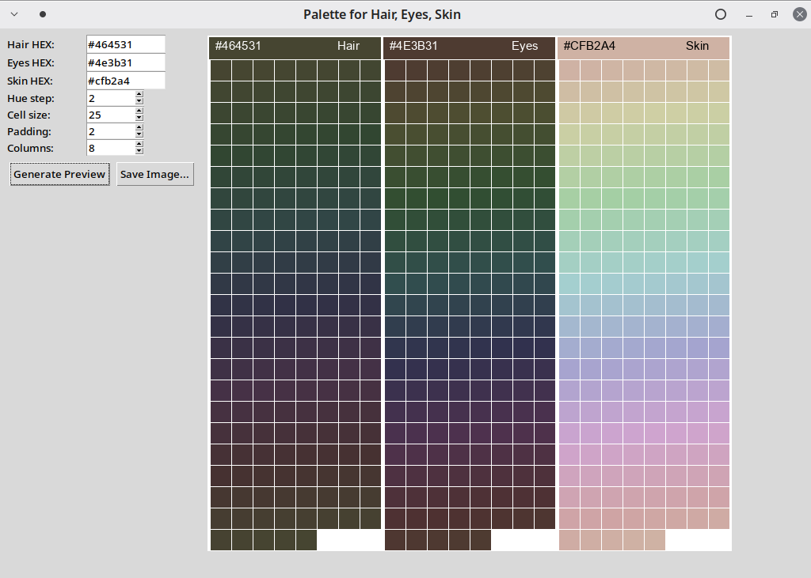
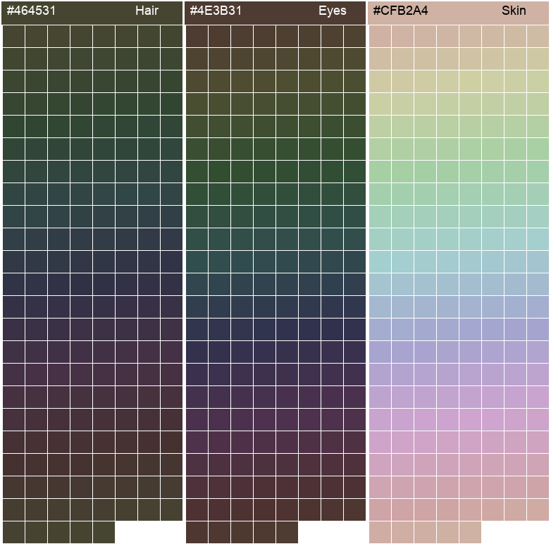

# Palette for Hair, Eyes, Skin
Generates a personalized color palette based on hair, eye, and skin colors (from three base HEX values).

Description
- Simple Tkinter app that generates three columns of color swatches derived from user-provided base HEX colors for hair, eyes, and skin.
- Exports a PNG image containing the palettes and displays a resizable preview.

Features
- Input base HEX for hair, eyes, and skin.
- Adjustable hue step, cell size, padding, and number of columns.
- Preview and save full-resolution PNG.

Usage
1. Run the script with Python 3 (Pillow and tkinter required):  
   ```bash
   python OutfitPaletteCLI-3.py
   ```
2. Enter HEX values (e.g., `#464531`, `#4e3b31`, `#cfb2a4`) or leave defaults.
3. Adjust Hue step, Cell size, Padding, and Columns.
4. Click "Generate Preview" to see the swatches.
5. Click "Save Image..." to export a PNG.

Implementation details
- Generates colors by converting the base HEX to HSL, rotating the hue across 0–360 by the given step, and converting back to RGB.
- Creates a three-column image with headers showing the base color and hex code.
- Uses Pillow for image creation and Tkinter for the GUI.

Dependencies
- Python 3.8+
- Pillow
- tkinter (usually included with Python)


